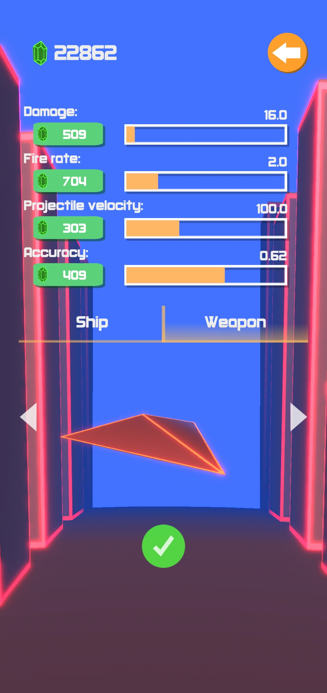
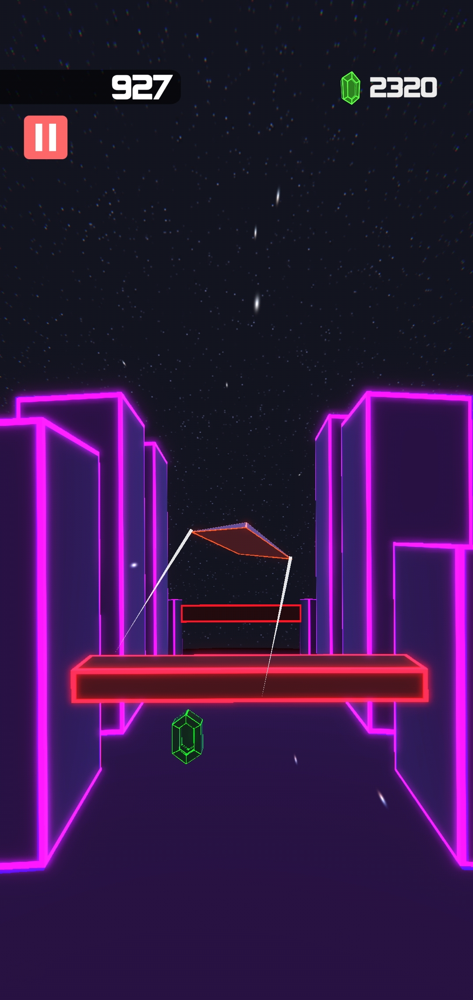
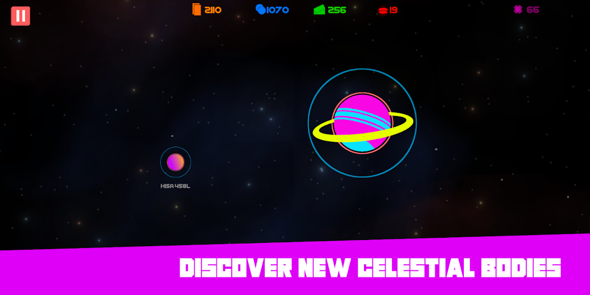
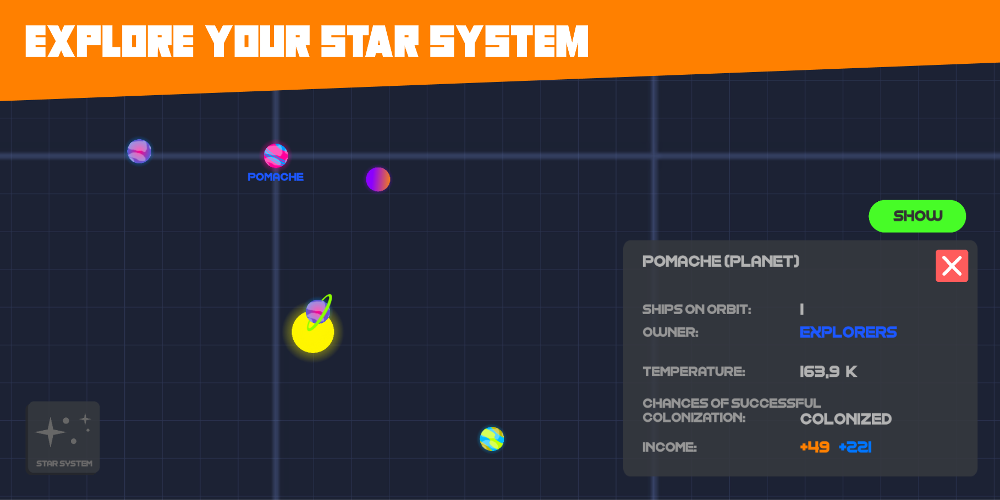

# My Games

## Planets At War: Space Battles *(work in progress)*

Turn-based space strategy game where you fight with other factions to take control over the star system.

- Google Firebase integration for multiplayer services
- Google Play Games Services integration
- Replay system for replaying previous turns made by other players
- Tested using Unity Test Framework
- Custom localisation system
- Singleplayer / Local multiplayer / Online multiplayer
- Player can close the game while in an online match and will be notified when it is he's turn again
- Fog of war

<!--

  

  

  

  

  

-->

  

  

<!-- 

  
   

 -->

  

<!-- 

  

  

  

  

  

 -->

https://github.com/user-attachments/assets/39ffa153-7607-449a-a696-6b6e6de3382b

## Endless Horizon

Endless runner type game where you have to avoid obstacles and fight with enemy ships.

- Procedural world and obstacles generation
- Day and night cycle
- Multiple ships with different stats and weapon systems
- Enemy ships AI with obstacle avoidance system (no ML)

[Google Play Store](https://play.google.com/store/apps/details?id=com.SpaceOver.EndlessHorizon)

  
   

https://github.com/user-attachments/assets/4a121d8f-46b1-4c88-ba52-55b6aeee795b

## Planets At War

Real-time space strategy game where you fight with other factions to take control over the star system.

- Google Play Games Services integration
- Procedural star system generation
- Gravity simulation for realistic planet movement
- Ships and planets upgrade system

[Google Play Store](https://play.google.com/store/apps/details?id=com.SpaceOver.PlanetsAtWar)

  
   

Video:

      

